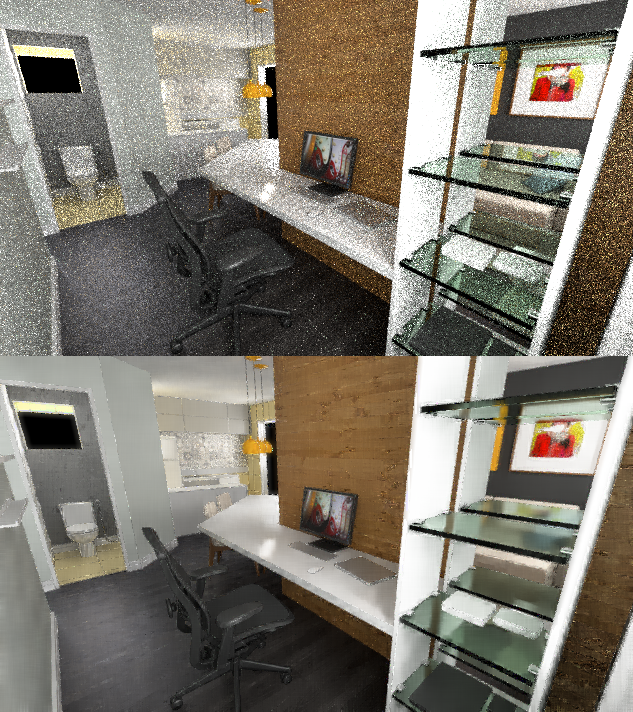
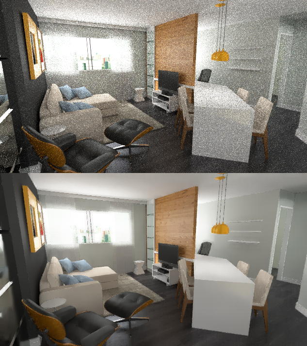
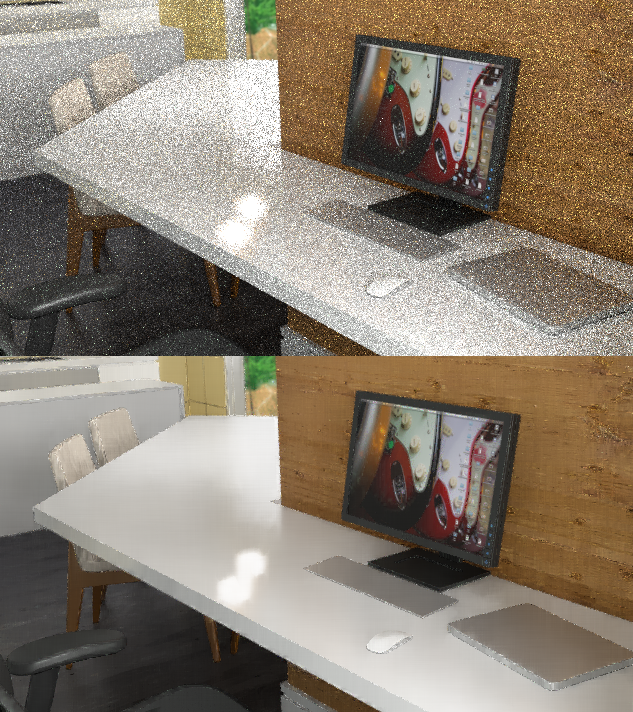
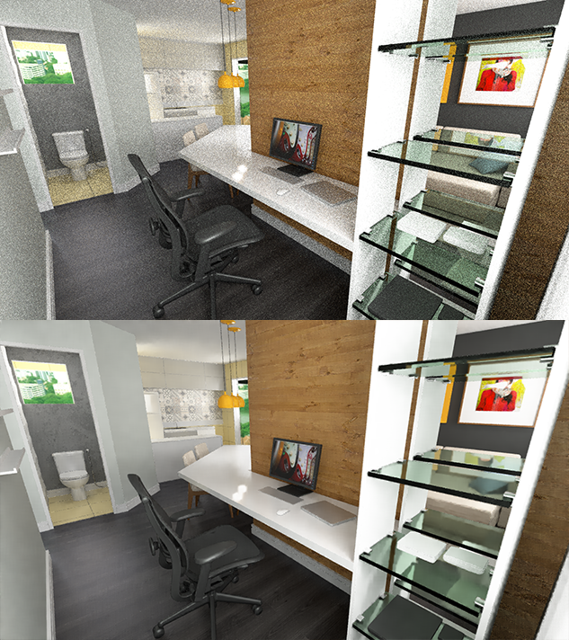

Render Pass Noise Reduction
===========================

Many ideas on how to reduce noise in a Blender Cycles render just work off the resulting image and focus on removing fireflies by blurring the image and then regrouping the pixels in some clever way. Some try to do edge detection, but in the end, we mostly end up with some algorithm that will blur a lot of the edges of the surfaces. Then it hit me: a Blender render has multiple render passes that can be exported to us virtually for free and some of these passes are either noiseless or noiseless with some aliasing. My proposal is to make use of those render passes to better detect the edges of surfaces in a render and offer more context to the de-noising algorithm.

The Idea
--------

Instead of applying edge detection to the final composite image, how about applying edge detection in different ways to the various render passes that are noiseless: Diffuse Color, Normal, Z? Noisy render passes can also be used to guide other parts of the render. This is mostly the gist of the idea. But how does it actually work?

1. Load as many useful passes as possible: right now we use the final Combined image, Ambient Occlusion, Diffuse Color, Normal, Z, Glossy Direct, Glossy Indirect, Transmission Indirect and Emission. Not all of these are required, but you should at least provide the Combined, AO, Diffuse Color, Normal and Z passes. Those are the ones that help the most.
2. A copy of the Combined image and the AO input are blurred to attenuate the noise in them. The AO image will be used to determine the areas with highest tolerance to noise in the algorithm. The blurred Combined image will be used as another delimiter. It helps to maintain a little glossy detail when no glossy pass is provided.
3. Some passes will be assigned specific value difference tolerances. The non-noisy passes will have particularly low tolerances so we keep most of the detail. Any pass not assigned a specific tolerance will have its tolerance varying between the minimum and maximum values as determined by the AO image's pixel values.
3. The blurred combined image and all the other passes except AO are sent as delimiters in the algorithm. By delimiter, I just mean that they are used to determine the limits of the surfaces.
4. The AO image is sent separately to serve as indicator of which areas might have the most noise.
5. The algorithm is a basic box blur with a twist. The only difference is that instead of weighting surrounding pixels by distance, we weight them by how much different they are from the original pixel based only on the delimiters and we ignore surrounding pixels that are too different.
6. In the end, this results in an image with reduced noise in the surface areas, while keeping texture detail (remember we have a diffuse color pass as delimiter). Unfortunately, the surface edges will be left untouched and will retain their original noise. To avoid this, we run a second pass where we calculate the difference between the original image and the output image and clip that value to their maximum and minimum values. In those pixels where the difference is 0 and are detected to be edges through the Normal and Z delimiters, we blend 50-50% between their values and the blurred combined image values. This attenuates edge noise, while not significantly blurring the overall image.

What's that step 5 again?!
--------------------------

Basically for each pixel (A), we do this:

1. For each pixel around (B), calculate the difference in value for each delimiter between this pixel (B) and the original pixel (A). For instance: what's the difference between the normal value at pixel B and pixel A and so on for each delimiter.
2. If that value exceeds the tolerance assigned to that specific delimiter, discard this pixel (B) in the blur algorithm. Any delimiter can exclude this surrounding pixel (B) from being used in the blur of pixel A.

Examples
--------

356p image rendered at 100 samples [before](samples/esccomp-356p-100samples/combined0001.png) and [after](samples/esccomp-356p-100samples/__combined.png)

2x 356p image rendered at 100 samples stacked [before](samples/salatv-356p-2x100samples/combined0001.png) and [after](samples/salatv-356p-2x100samples/__combined.png)

Crop of 1080p image rendered at 100 samples [before](samples/esccomp-1080p-100samples/combined0001.png) and [after](samples/esccomp-1080p-100samples/__combined.png)

Same 1080p image rendered at 100 samples, filtered, then reduced to 33% [before](samples/esccomp-1080p-100samples/combined0001-33percent.png) and [after](samples/esccomp-1080p-100samples/__combined-33percent.png)

What's Good
-----------

- It's fast. On a 2.3GHz Core i5 processor, using all available passes, it takes around 60 seconds to run on a 4800x2700 image. If you don't need very precise render results, it's faster to stop a few 1000 samples short and pass the image through the algorithm to remove those last bits of noise.
- It's tunable. The algorithm currently supports setting parameters to blur more or less, seek from a larger or smaller area, and alter the various tolerances in case there's some weird topology that needs tuning.
- For preview purposes, you can render a larger version of the image at low samples (I've got half decent results with 100 samples on interior scenes), pass it through the algorithm and then downsize the image to get rid of some of the edge noise.

What's Bad
----------

- One glaring problem with this approach is that transparent and glossy surfaces output to the Normal and Z passes their own normals, not the normals of the refracted or reflected surfaces. This makes it so that, on those surfaces, the algorithm either has no noiseless parameters to work with or has a noisy parameter (Glossy Indirect, Transmission Indirect) to work with, which might be equally as bad.
- Edges will either retain their original noise or will get slightly blurred depending on how you apply the algorithm. Sometimes a larger render is required to be downsampled later in order to reduce edge noise (at 100 samples, sometimes you should render at 250% scale in order to downsize and have a pristine image).
- Even with the contextualized blur, some shadow detail will be lost. This is unavoidable. At low sample rates, we need to start off at a higher blur radius per surface in order to actually achieve a noiseless surface.
- Render stacking is welcome. The algorithm deals best with 2 100-sample images (with different sampling seeds) stacked together than one 200-sample image because the stacked render takes care of some of the fireflies that the 200-sample image won't.

The Code
--------

The custom algorithm for surfaces is located in *LMImageRepresentationBlurSurfaces.cpp*, under *bool LMImageRepresentation::blurSurfaces(...)*.

The custom algorithm for surface edges is located in *LMImageRepresentationBlurEdges.cpp*, under *bool LMImageRepresentation::blurEdges(...)*.

Under the *bin-osx* folder, there is a precompiled OS X binary. The code should be easily portable (just replace the two load/save image functions). Should you have any questions with the executable, run it with the *-h* parameter and it will explain its parameters and what they alter.